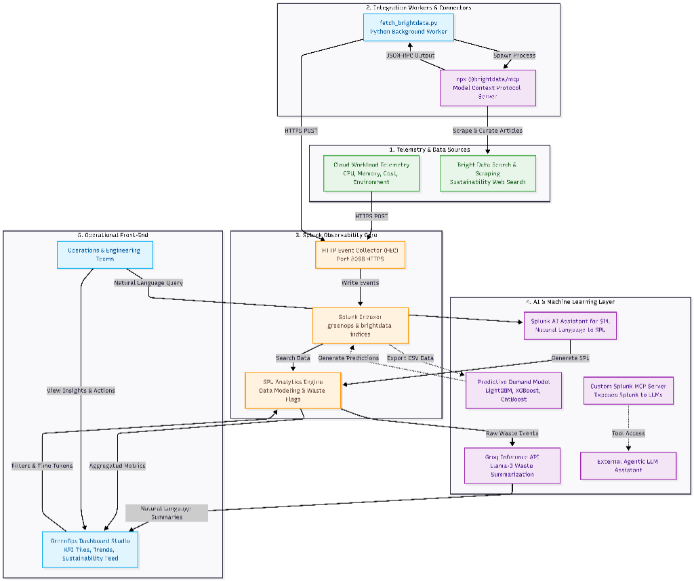

# GreenOps Architecture & Data Flow

This document details the system architecture of **GreenOps**, illustrating the flow of cloud telemetry, external sustainability intelligence, machine learning model outputs, and generative AI features into the **Splunk Dashboard Studio** interface.

---

## 1. System Architecture Diagram


graph TB

%% Styles
classDef splunk fill:#FFF3E0,stroke:#FF9800,stroke-width:2px,color:#5D4037
classDef client fill:#E1F5FE,stroke:#03A9F4,stroke-width:2px,color:#01579B
classDef ai fill:#F3E5F5,stroke:#9C27B0,stroke-width:2px,color:#4A148C
classDef data fill:#E8F5E9,stroke:#4CAF50,stroke-width:2px,color:#1B5E20

%% Data Sources
subgraph DataIngestion["1. Telemetry & Data Sources"]
    Telemetry["Cloud Workload Telemetry\nCPU, Memory, Cost, Environment"]:::data
    BrightData["Bright Data Search & Scraping\nSustainability Web Search"]:::data
end

%% Integration Layer
subgraph Workers["2. Integration Workers & Connectors"]
    BDWorker["fetch_brightdata.py\nPython Background Worker"]:::client
    BDMCP["npx @brightdata/mcp\nModel Context Protocol Server"]:::ai
end

%% Splunk Core
subgraph SplunkCore["3. Splunk Observability Core"]
    HEC["HTTP Event Collector (HEC)\nPort 8088 HTTPS"]:::splunk
    SplunkIndex["Splunk Indexer\ngreenops & brightdata indices"]:::splunk
    SPLSearch["SPL Analytics Engine\nData Modeling & Waste Flags"]:::splunk
end

%% AI Layer
subgraph AICore["4. AI & Machine Learning Layer"]
    Groq["Groq Inference API\nLlama-3 Waste Summarization"]:::ai
    SplunkAI["Splunk AI Assistant for SPL\nNatural Language to SPL"]:::ai
    MLModel["Predictive Demand Model\nLightGBM, XGBoost, CatBoost"]:::ai
    SplunkMCP["Custom Splunk MCP Server\nExposes Splunk to LLMs"]:::ai
    ExternalAI["External Agentic LLM Assistant"]:::ai
end

%% Front End
subgraph Visualization["5. Operational Front-End"]
    Dashboard["GreenOps Dashboard Studio\nKPI Tiles, Trends, Sustainability Feed"]:::client
    Operator["Operations & Engineering Teams"]:::client
end

%% Data Flow
Telemetry -->|HTTPS POST| HEC

BDWorker -->|Spawn Process| BDMCP
BDMCP -->|Scrape & Curate Articles| BrightData
BDMCP -->|JSON-RPC Output| BDWorker
BDWorker -->|HTTPS POST| HEC

HEC -->|Write Events| SplunkIndex
SplunkIndex -->|Search Data| SPLSearch

%% ML Pipeline
SplunkIndex -.->|Export CSV Data| MLModel
MLModel -.->|Generate Predictions| SplunkIndex

%% AI Integrations
SPLSearch -->|Raw Waste Events| Groq
Groq -->|Natural Language Summaries| Dashboard

Operator -->|Natural Language Query| SplunkAI
SplunkAI -->|Generate SPL| SPLSearch
ExternalAI["External Agentic LLM Assistant"]:::ai

SplunkMCP -.->|Tool Access| ExternalAI

%% Dashboard Interaction
SPLSearch -->|Aggregated Metrics| Dashboard
Dashboard -->|Filters & Time Tokens| SPLSearch
Operator -->|View Insights & Actions| Dashboard
---

## 2. How the Application Interacts with Splunk

GreenOps interfaces with Splunk via standard HTTP endpoints and query engines to support ingestion, analytics, and visualization:

1. **Splunk HTTP Event Collector (HEC) Ingestion (Port 8088):**
   - Cloud telemetry metrics (resource usage logs, costs, regions) are pushed to the Splunk HEC endpoint via secure HTTPS POST requests.
   - The Python background worker `fetch_brightdata.py` polls external sustainability news and sends structured JSON events directly to Splunk HEC with the sourcetype `sustainability_feed`.

2. **Splunk Search & Analytics Engine (SPL):**
   - Core analytics and fields extraction (such as waste flags, cost allocations, average CPU, and news categorization) are done inside Splunk using **Search Processing Language (SPL)**.
   - The queries aggregate, sort, and filter the raw events in real time based on active dashboard time tokens.

3. **Dashboard Studio (`7_7.json`):**
   - The user-facing dashboard runs SPL queries directly against the indexer. 
   - Interactive UI elements (time range pickers, drop-downs) pass search parameters dynamically as tokens, isolating and rendering views for the general dashboard and the specialized Sustainability tab.

---

## 3. How AI Models and Agents are Integrated

AI is integrated natively across the GreenOps workflow at different checkpoints:

| AI / ML Component | Tech Stack | Role in GreenOps | Interface / Protocol |
| :--- | :--- | :--- | :--- |
| **Bright Data MCP Server** | `npx @brightdata/mcp` | Uses AI-ranked web crawling to fetch real-time news about green computing and data center energy efficiency. | JSON-RPC over local `stdio` subprocess |
| **Groq / Llama 3 summarizer** | Groq API | Translates raw, complex resource waste logs into natural language explanations. | HTTPS REST API |
| **Splunk AI Assistant for SPL** | Splunk App | Translates natural language questions from operators into operational SPL queries. | Native Splunk UI Integration |
| **Predictive Demand Model** | LightGBM, XGBoost, CatBoost | Forecasts future traffic demand and capacity needs (via `train_model.py`), aiding proactive scaling and carbon footprint reduction. | Local file system (`dataset/` -> `submission.csv`) |
| **Splunk MCP Server** | Custom node/python server | Exposes Splunk's SPL engine as tools to external LLMs/agents. | Standard Model Context Protocol (stdio/SSE) |

---

## 4. End-to-End Data Flow

The flow of data through GreenOps follows four primary pipelines:

### Pipeline A: Cloud Telemetry & Cost Waste Ingestion
```
Telemetry Source ---> Splunk HEC ---> greenops index ---> SPL Queries ---> Dashboard KPI Tiles & Tables
```
1. Cloud resource events (CPU utilization, RAM, instance configuration, cost) are logged.
2. Log ingestion forwards records to the Splunk HEC.
3. The Splunk Indexer categorizes and indexes events.
4. Dashboard Studio runs SPL queries to detect anomalies and underutilization (e.g., CPU < 5% flagged as waste candidate).

### Pipeline B: Sustainability Intelligence Feed
```
fetch_brightdata.py (Python) 
   │ (spawns stdio process)
   ▼
npx @brightdata/mcp 
   │ (discover tool query)
   ▼
Bright Data Scraping Engine (Web Search) ---> npx @brightdata/mcp ---> fetch_brightdata.py ---> Splunk HEC ---> brightdata index ---> Dashboard Feed Panel
```
1. The background script `fetch_brightdata.py` executes every 5 minutes (default `POLL_SECONDS=300`).
2. It establishes a stdio-based JSON-RPC connection with `npx @brightdata/mcp`.
3. It invokes the `discover` tool with the query: *"sustainability green computing energy efficiency data center renewable energy"*.
4. The MCP server fetches and processes AI-ranked web articles.
5. The parsed JSON results are returned to the worker script, which posts them to Splunk HEC.
6. The Splunk Dashboard visualizes the feed categorized by topics (e.g., *Green Computing*, *Energy Efficiency*).

### Pipeline C: Predictive Demand Planning
```
train.csv & test.csv ---> train_model.py (Ensemble: LightGBM + XGBoost + CatBoost) ---> submission.csv (Traffic Predictions)
```
1. Telemetry history is collected as a tabular dataset.
2. The ML training script `train_model.py` runs a bagged ensemble of LightGBM, XGBoost, and CatBoost models.
3. Spatial features (geohash, KDTree distance weighting) and temporal features (rushing hours, time slots) are extracted.
4. The output forecasts future traffic demand, allowing engineers to pre-scale infrastructure to match demands, minimizing energy waste.

### Pipeline D: Agentic Splunk Interaction (Exposing Splunk to AI)
```
External AI Agent ---> Splunk MCP Server (STDIO/SSE) ---> Splunk REST API (Port 8089) ---> Splunk Search Engine
```
1. An external AI agent (e.g., an LLM running in a client framework) connects to the **Splunk MCP Server**.
2. The agent executes tool calls like `run_query` or `get_alerts` in plain English.
3. The Splunk MCP server translates the command, makes a REST API request to Splunk on port 8089, and returns the query results back to the agent.

---

> [!NOTE]
> All credentials for Splunk HEC, REST API, and Bright Data MCP are configured securely using an `.env` file at the root of the repository, preventing hardcoded tokens in the source code.

> [!TIP]
> To verify the ingestion worker is actively writing data, check the events index with: `index=* sourcetype=sustainability_feed`.
